# Results

GitHub: [LeHoang510/Robocasa-RL-project](https://github.com/LeHoang510/Robocasa-RL-project)

Project Drive: <https://drive.google.com/drive/folders/1HE1ZfvGqZCAy_0qYc3lcxlwaDj3IEOvQ?usp=drive_link>

[Checkpoints Drive](https://drive.google.com/drive/folders/1kv1jmcNdFvAvqIPdTvoA4bCtKnhA0LLQ?usp=sharing)

[Grasp Apple Demo](https://drive.google.com/drive/folders/11PGHeSptKgiDN1L4ndSVkS-wwyTWu0i8?usp=drive_link)

[CoffeePressButton Demo](https://drive.google.com/drive/folders/1k9zvdfu33N8C3tRVwedxkUBKx9ay5DTc?usp=drive_link)

Only these two demos were generated because the other experiments all failed, so making demo videos for them was unnecessary.

## Phase 1

### Experiment 1 - PPO Baseline

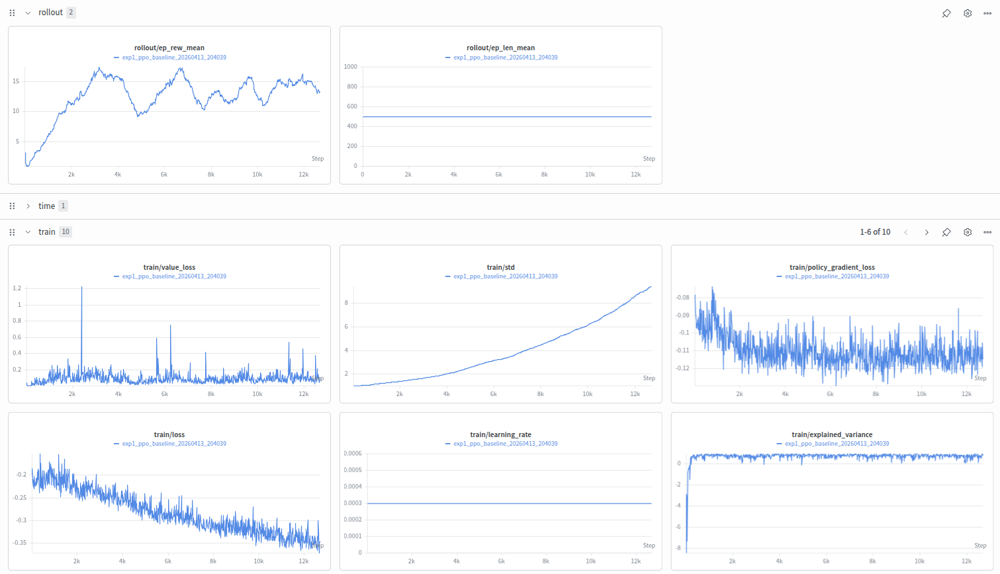

### Experiment 2 - PPO + Curriculum

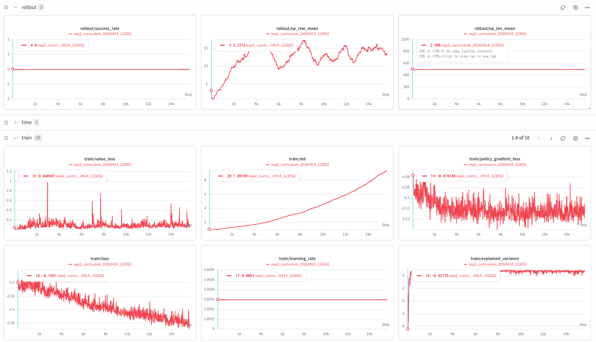

### Experiment 3 - SAC Baseline

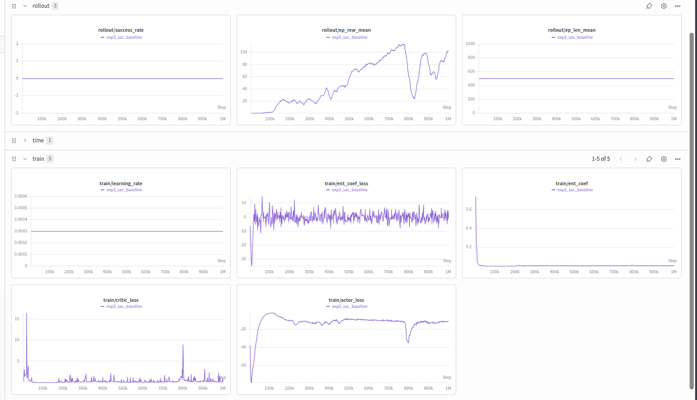

### Experiment 4 - SAC + HER

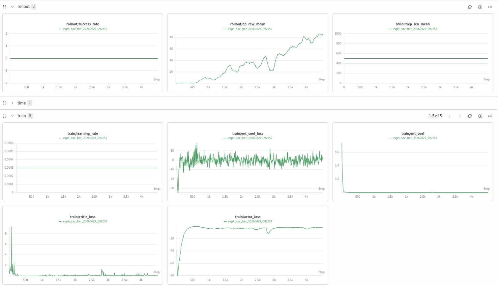

### Experiment 5 - Behavioral Cloning

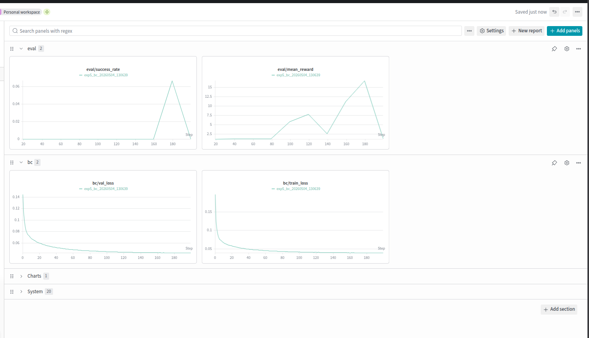

### Experiment 6 - Diffusion Policy

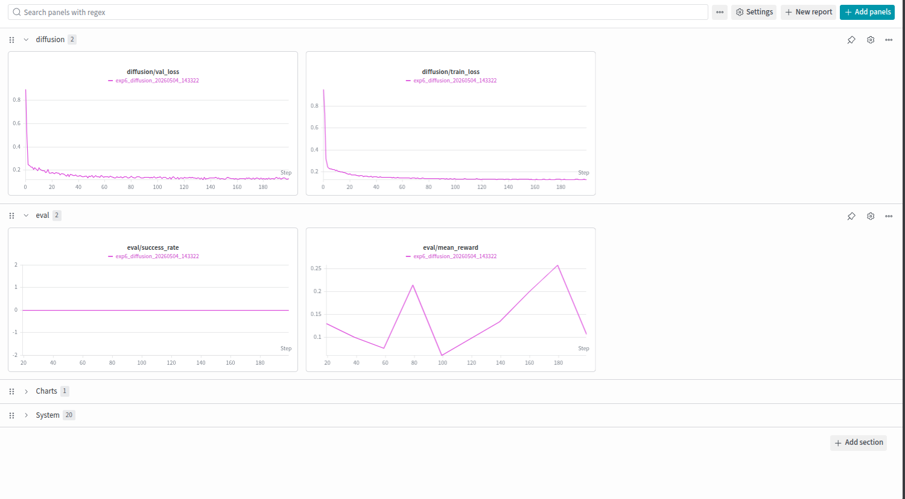

### Experiment 7 - TD3+BC

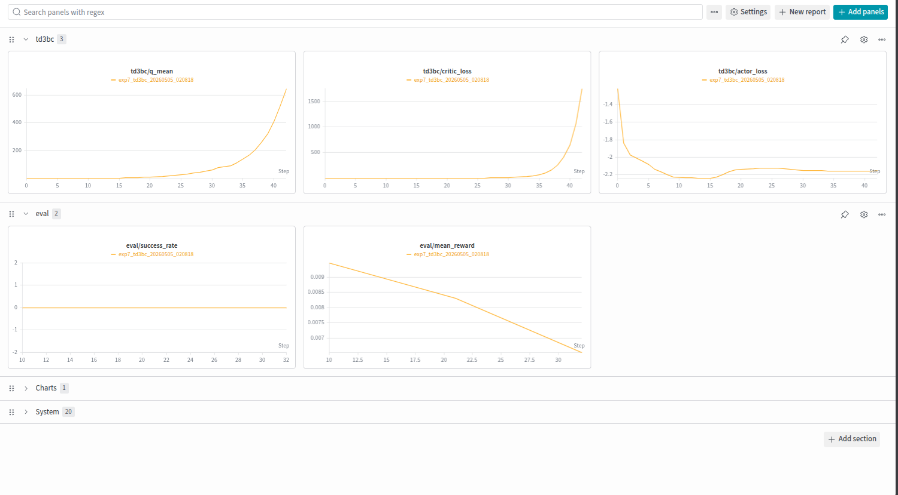

### Experiment 8 - IQL

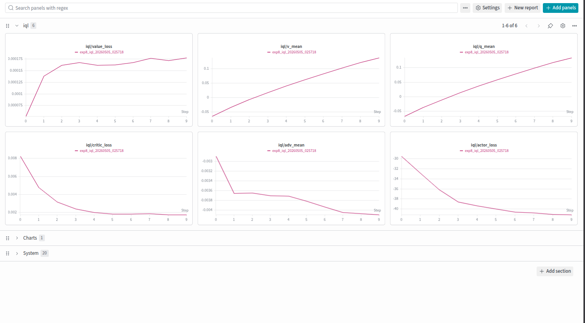

### Experiment 9 - SAC Privileged

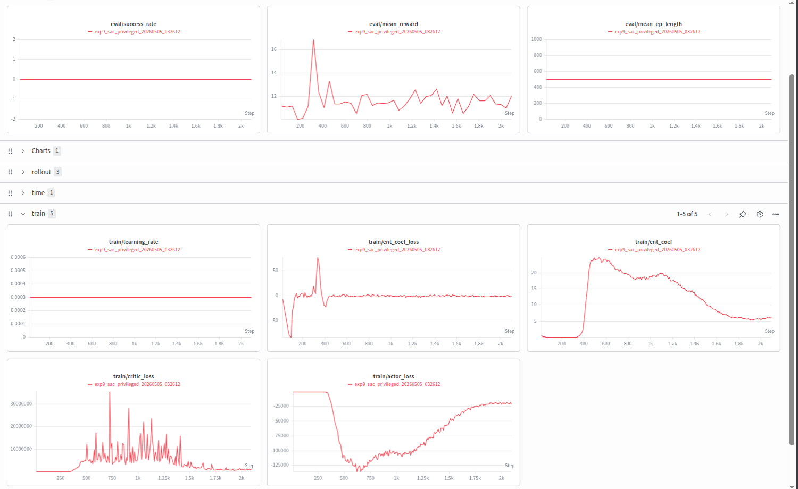

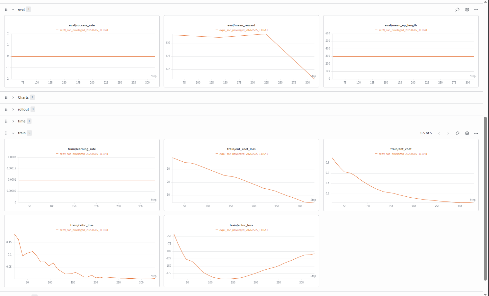

## Phase 2

### Diffusion Policy 25D

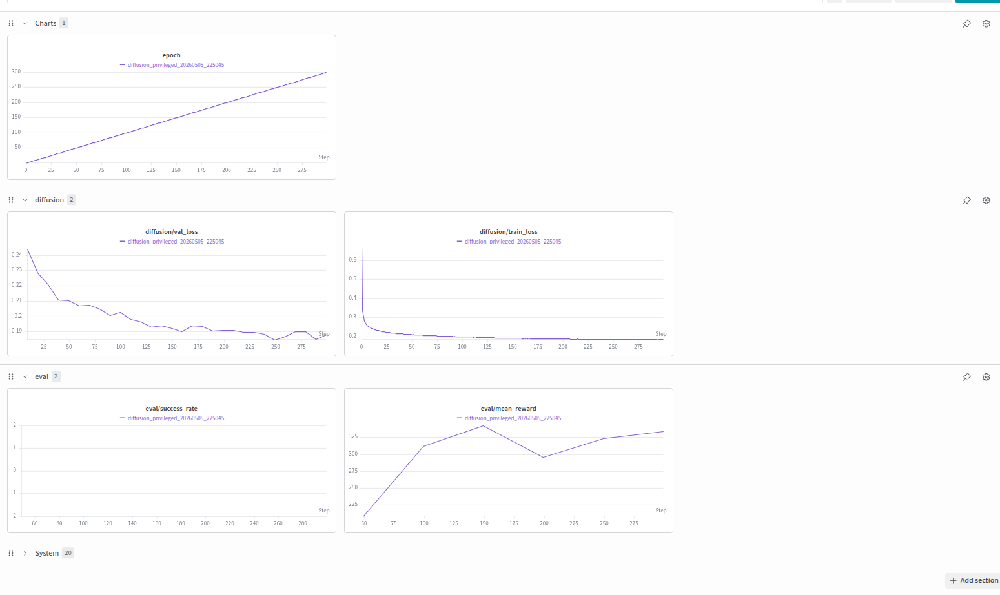

### SAC Grasp

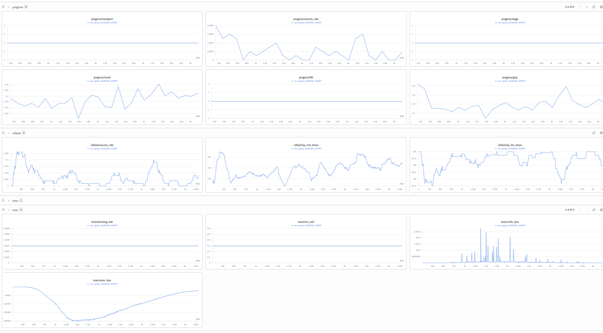

### ACT + ResNet18

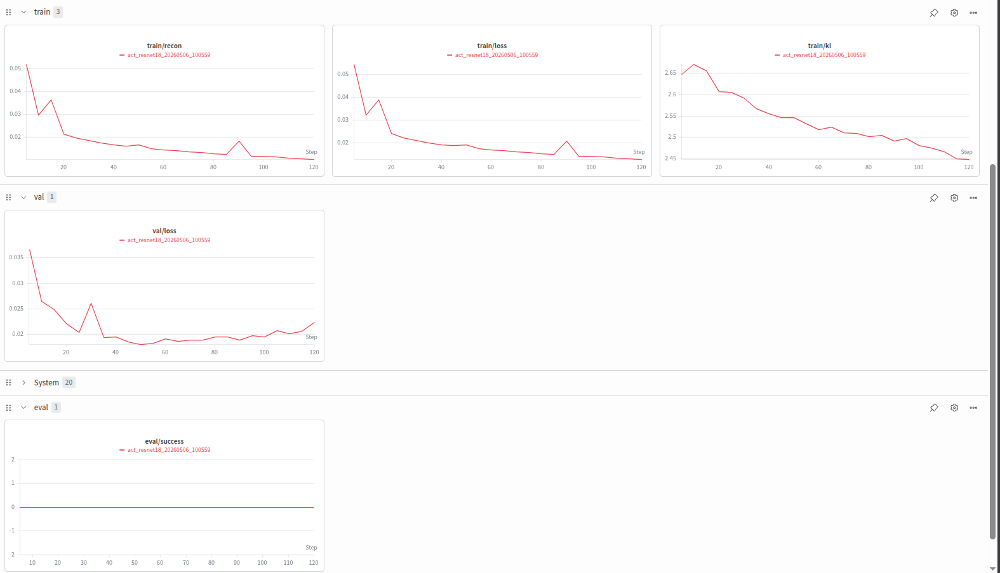

## Phase 3

### CoffeePressButton

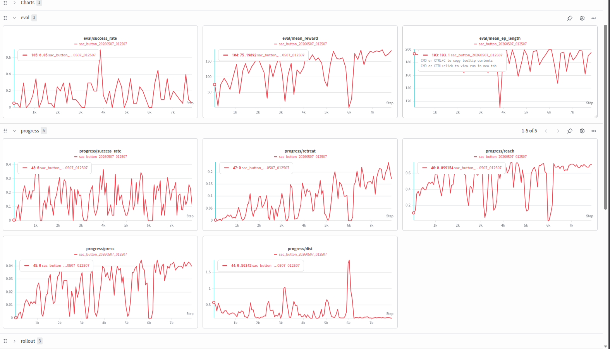

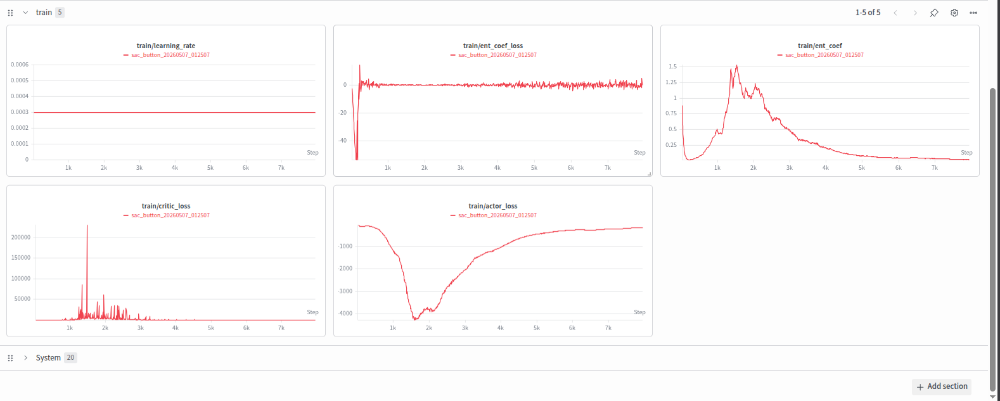
